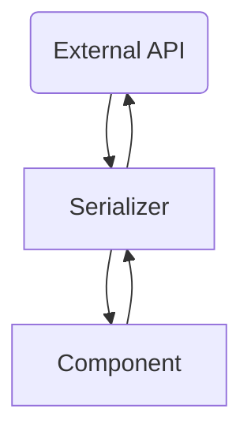

# Coding Standards

## Introduction
> You can't write perfect software. [^tip-36]

Nobody on the team writes perfect software. So what can we do to protect ourselves and others from letting imperfect software become bad software?

| **Important:** Most style decisions should be enforced with the linter. If the linter _can_ enforce a rule, it _should_. |
| --- |

## 1. Data Dominates

> If you've chosen the right data structures and organized things well, the algorithms will almost always be self-evident. Data structures, not algorithms, are central to programming.
> - Sacha [^data-dominates]

The rules, suggestions, patterns, conventions and principles in this guide mostly point back to this one premise—data dominates.

They're broken down into sections:
- **principles** (these are essential and should only be broken with clear reasoning, usually pointed out with comments in code)
- **patterns** (these are helpful patterns that will be often repeated to solve some of the more frequently recurring situations we find in the code)

| **Important:** Nothing is beyond questioning and all things can be broken when the situation demands it. |
| --- |

### Checking Data
There are a few code smells that can help act as hints that maybe your data isn't "right". These aren't hard rules, but they are usually accurate at helping find where complexity has moved down or spread out.

1. prefer immutable to mutable
2. prefer expressions to statements
3. prefer pure functions to side-effects
4. (bonus) prefer function composition to imperative flow

#### 1. prefer immutable to mutable
In Javascript this is often simple from a syntax standpoint—prefer `const` to `let`.

```js
// Bad
let item = { name: 'foo' }

// Good
const item = { name: 'foo' }
```

But that's not a very useful example. Let's just hold onto this one and see how it works together with the next preference.

##### Motivation:
- Predictable state.

#### 2. prefer expressions to statements
In Javascript, expressions return a value, statements do not.

```js
// Bad
let isValid = false

if (item.status === '200') {
	isValid = true
}

// Good
const isValid = item.status === '200'
```

Yet again, not a very useful example but we can see how preference #1 (immutable data) works together with our statement.

##### Motivation:
- Predictable state.
- Not branching logic.

#### 3. prefer pure functions to side-effects
With UI development, side-effects are an essential part of the process—updating the DOM, talking to services, etc...

```js
// Bad
let 

// Good

```

#### 4. (bonus) prefer function composition to imperative flow
(See also: Patterns: 7. Rule Engines)

```js
// Bad

// Good
```
---
### AAA
1. Arrange
2. Act
3. Assert

#### Actions, Calculations and Data [^Grokking-Simplicity]
**Actions**
* functions with side-effects
* updating the DOM
* throwing an exception

**Calculations**
* pure functions
* expressions

**Data**
* state

#### 1. Arrange
Check the data.
Use Typescript types.
Sanitize data to match the expected incoming schema.
Filter out "bad" data.

#### 2. Act
Apply the rules (logic, business rules, requirements).

#### 3. Assert
Sanitize data to match the expected return schema.
Return the result.

#### AAA At the Application Scope


##### **External APIs**
The external APIs represent data that is beyond the control of our application.

These APIs may be served by our own backend or they may be third-party services such as Slack, Google Calendar, Twilio, Okta, etc...

##### **Serializers**
*incoming data*

By considering all external data to be "unsafe", we serialize it before it has a chance to enter our application.

Even if we control our API, we want to serialize all data so that we're decoupled from API changes down the line.

Additonally, we often want to do simple data transformation on properties such as dates/times, custom objects, etc...

*outgoing data*

Similarly to incoming data, our serializers give us a chance to format our application state into something our services expect.

By having a serialization layer, we keep all knowledge and changes to our data in a single place.

##### **Components**
Once all our data has been serialized for our internal application state, our components can act confidently that they have all required data and that it is of the correct type. This prevents extra data checks downstream.

#### AAA At the Function Scope

### Decisions as Data
- Keep business rules separate from the data and the handling of those rules.
- Make decisions with the data through schemas, types, sets.
- Act on decisions with expressions—map, reduce, filter, sort...

### Miscellaneous
Make it hard to introduce confusion.

[^tip-36]: (Prag p. 103)
[^data-dominates]: https://www.acco.io/i-escaped-node
[^Grokking-Simplicity]: Normand, E., Steele, G., & Kerr, J. (2021). Part 1: Distinguishing actions, calculations, and data. In _Grokking simplicity: Taming complex software with functional thinking_ (p. 19). Manning Publications Company.
